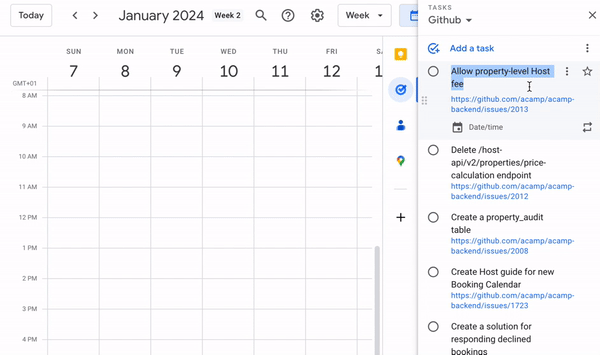
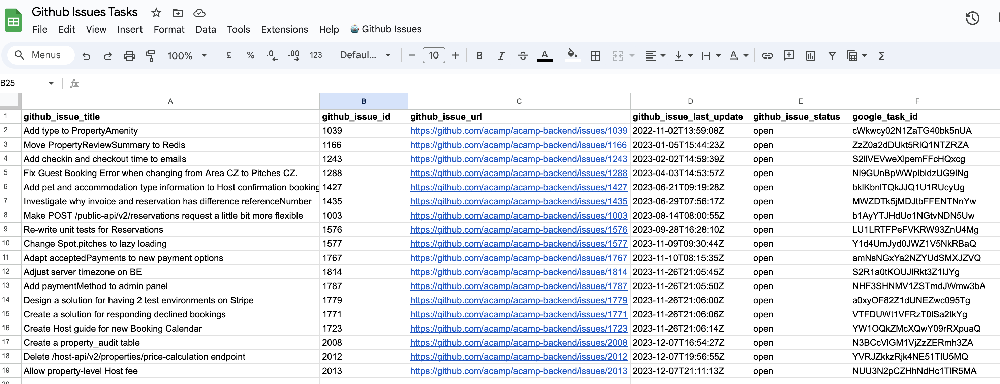
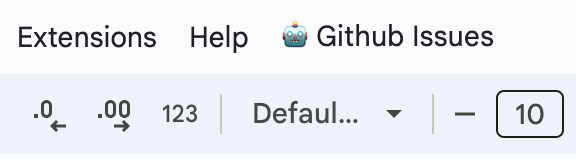

# GitHub Issues on Google Tasks

This is the source code for a Google Script that retrieves your GitHub issues and create corresponding tasks for them on Google Tasks. This allows you to see your Issues on the Google Tasks app/website or plan when to work on them on your Google Calendar.

## Features

- Fetches your Issues using the GitHub API and creates a new task on Google Tasks for each new GitHub Issue.
- Automatically syncs tasks with your GitHub issues to keep them up to date. When a issue is closed the task is automatically set as `completed`. The task also gets updated if you change its respected Github Issue title.
- You can schedule the frequence for the task updates for every hour, every 4 hours or once a day.

## Requirements

Before using this app, make sure you have the following:

- A GitHub token with access to the repository containing the Issues you want to sync. The token needs to have the roles `repo` and `user`
- A Google account.

## Setup

1. Make a copy of [this spreadsheet](https://docs.google.com/spreadsheets/d/1YDIH2kyJrYJ29bEfck_ncZdb6BXDfU4d_uWqOYllDlo/edit#gid=0).
This sheet will act like a simplified "database" for you to visualized all the tasks that were created based on your Github Issues, and your script will be connected to it.

*Example of a Google Sheet with the Google Tasks created based on your Github Issues.*

1. Inside your copied spreadsheet, you will see a custom menu called `🤖 Github Issues` like this:

   

Start by clickin on the menu `Setup -> Create setup`. You will be prompted to input the following 5 environment variables for the script to work:

- Your Github key
- Your Github username
- The Github organization name for your repository (or your own Github username if you own the repository)
- Your repository name
- The name of your task list on Google Tasks
  
If you skeptical about inputing these information on a UI, you can do it directly via code using the instructions in the Appendix.

## Usage

1. Open your copied Google Sheet.

2. In your copied sheet, the menu `🤖 Github Issues` will show you those 4 options:

   1. `Setup`
   Can be used to create or change the environment variables described on the `Setup` section
   2. `Generate new tasks`
   After the confirmation, the script will fetch all your Github opened Issues and create a Google Task for each one of them.
   3. `Schedule tasks`
   This create a scheduler to automatically fetch your new or updated Issues from Github and create/update their respective tasks. You can create a scheduler to run every hour, every 4 hours or once a day. You can also delete all existing schedulers from this menu.
   4. `Delete all tasks`
   In case you need a fresh starts, this removes all the tasks from your list. This only deletes the Google Tasks for the list you defined on the `Setup` menu (including the ones **not** created by the script). It doesn't delete or change anything on the Github side.

## Limitations

- You can only fetch up to 100 Github Issues per call. In case you have more than that, that's your cue to clean up your old issues 😂

## Appendix

If you want to set the environment variables yourself instead of using the UI menu, you can do it following these steps:

1. Open your copied spreadsheet and click on `Extension -> Apps Script`
2. On the left menu, click on `Project Settings`
3. Under `Script Properties`, create the following variables:
   1. `githubKey` with your Github token.
   2. `githubOrganization` with the organization name of your repository.
   3. `githubRepository` with the name of your repository.
   4. `githubUsername` with your Github username.
   5. `taskListId` with the ID of your task list on Google Tasks; if you need help finding this ID you can run the method `getAllTaskLists` from the file `Utils.js`

## Contributing

Contributions are welcome! If you have any suggestions, bug reports, or feature requests, please open an issue or submit a pull request.

## License

This project is licensed under the [MIT License](LICENSE).
